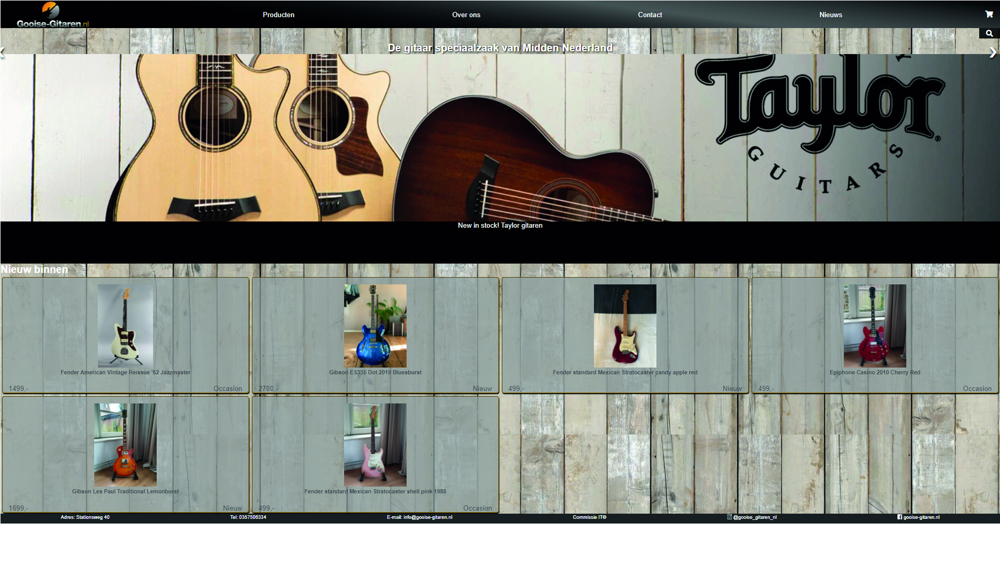

# Procesverslag
**Auteur:** Joeri Bouwman

Markdown cheat cheet: [Hulp bij het schrijven van Markdown](https://github.com/adam-p/markdown-here/wiki/Markdown-Cheatsheet). Nb. de standaardstructuur en de spartaanse opmaak zijn helemaal prima. Het gaat om de inhoud van je procesverslag. Besteedt de tijd voor pracht en praal aan je website.

## Bronnenlijst
1. www.gooise-gitaren.nl
2. www.w3schools.com
3. https://codepen.io/erikterwan/pen/EVzeRP
4. https://codepen.io/shooft/pen/BaKGKwm
5. https://codepen.io/joeribouwman25/pen/ExyJVrm
6. https://developer.mozilla.org/en-US/docs/Web/CSS/linear-gradient()
7. https://cssgridgarden.com/#nl
8. https://css-tricks.com/snippets/css/a-guide-to-flexbox/
9. https://css-tricks.com/snippets/css/complete-guide-grid/
10.https://css-tricks.com/

## Eindgesprek (week 7/8)
De index en product pagina hebben een carrousel met images gekregen. lastig hier aan was dat een deel van de images op display none moeten staan waardoor de elementen hier op heen lastig te positioneren waren.
Wanneer je de product pagina staan klapt de carrousel met images uit tot een grid met images. het was erg lastig om het juiste grid raster te definieren aan de hand van verschillende afbeelding groottes, na veel worstelen is dit uiteindelijk gelukt. 

Helaas is de website niet volledig af omdat dit een te groot project zal worden. wel kijk ik met tevredenheid terug op de berg werk die wel verzet is en zal ik in de toekomst verder werken aan de website om hem aan Gooise gitaren te kunnen laten zien. 

**Screenshot(s):**

 

## Voortgang 3 (week 6)
Er is een begin gemaakt aan de product pagina, ik vond het lastig om mijn CSS voor meerdere pagina's in te zetten dit heb ik opgelost door per pagina de body een class mee te geven en binnen deze classes elementen aan te spreken. Ook zijn er images aan de index pagina toegevoegd en heb ik de artikel informatie op de juiste manier gepositioneerd door middel van flexbox.

**Screenshots:**

  

## Voortgang 2 (week 5)

De header is nu goed gepositioneerd, ook zijn de producten nu gepositioneerd met grid in plaats van flexbox. Waar de producten eerst als Li in mijn html structuur stonden zijn dit nu Articles geworden om het semantisch correct te maken. Ook is er een animatie op het winkelwagentje gezet waardoor deze uit het scherm wegrijdt wanneer deze wordt aangeklikt. De skelet structuur van de product pagina is gemaakt.

**Screenshots:**

## Voortgang 1 (week 3)

### Stand van zaken
De header is responsive, zodra de website breder wordt verdwijnt het hamburger menu en is de navigatie over de hele breedte te zien. wat nu nog niet gelukt is, is het logo in het midden te positioneren en de verschillende elementen uit de nav gelijk aan elkaar uit te lijnen. 

De verschillende producten (gitaren) zijn nu ook gepositioneerd met flex en werkt responsive.
De header is nu gepositioneerd met flexbox. 
**Screenshots:**

   

## Breakdownschets (week 1)

Ik heb de breakdown schetsen van de home en product pagina gemaakt, kijkend in de browser zijn er veel elementen die niet kloppen, zoals een H2 element gebruiken als een section en een Menu element gebruiken als Footer. Veel ruimte voor verbetering dus!

Ook heb ik geoefent met lettertypes in de volgende codepen:
https://codepen.io/joeribouwman25/pen/wvWNyKp

## Intake (week 1)
-uitwerken voor de kick-off werkgroep - begin van de eerste week-

**Je startniveau:** Rood/Zwart

**Je focus:** ik wil mij focussen op het Responsive maken van de website. De website ziet er nu verschrikkelijk uit en het lijkt mij dan ook een mooie uitdaging om de website op te krikken en met een CMD sausje te overgieten. 

**Je opdracht:** www.gooise-gitaren.nl

**Screenshot(s) van de eerste pagina (small screen):**    **Screenshot(s) van de tweede pagina (small screen):**

   

